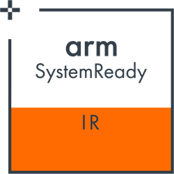
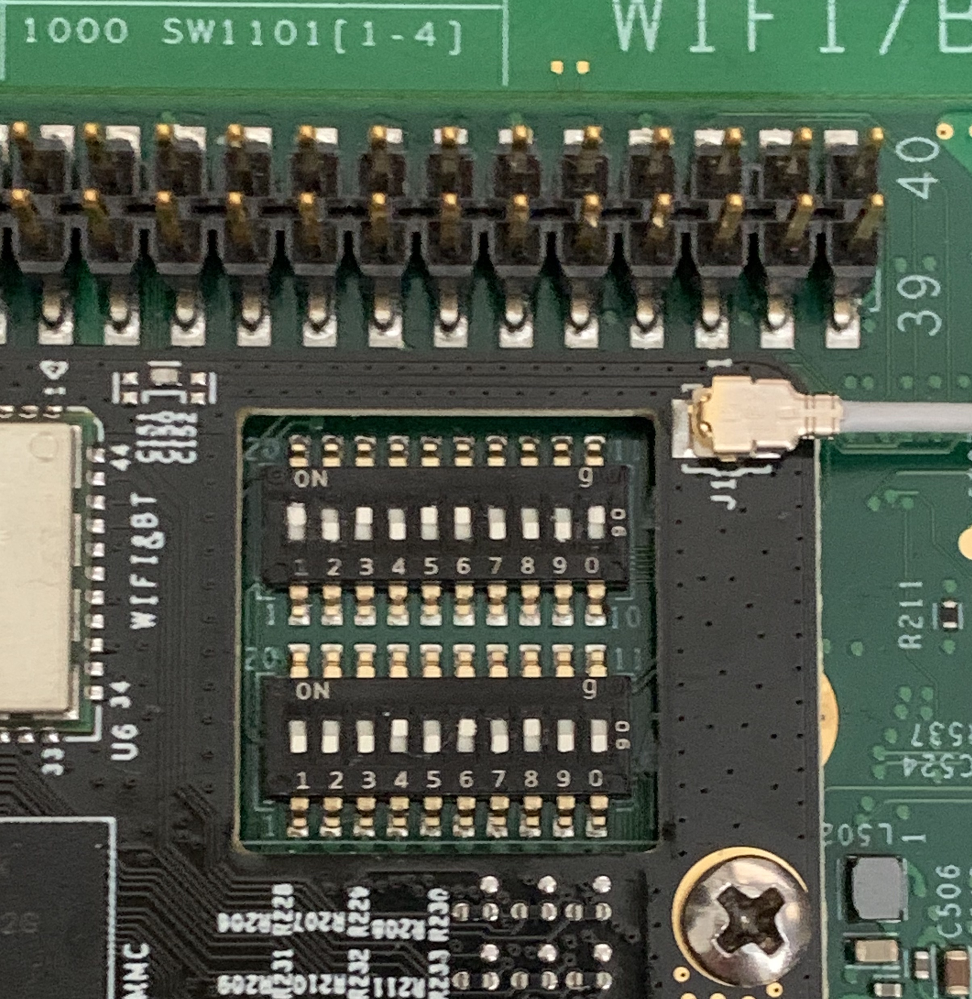
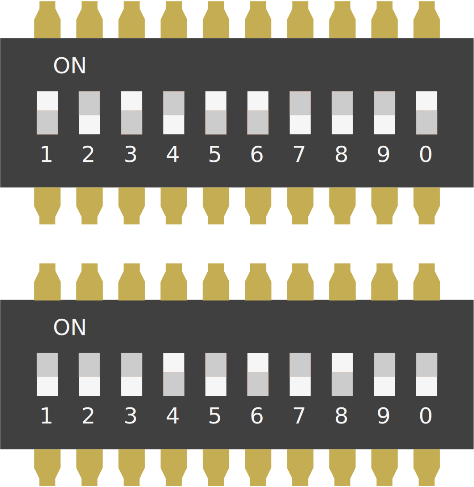
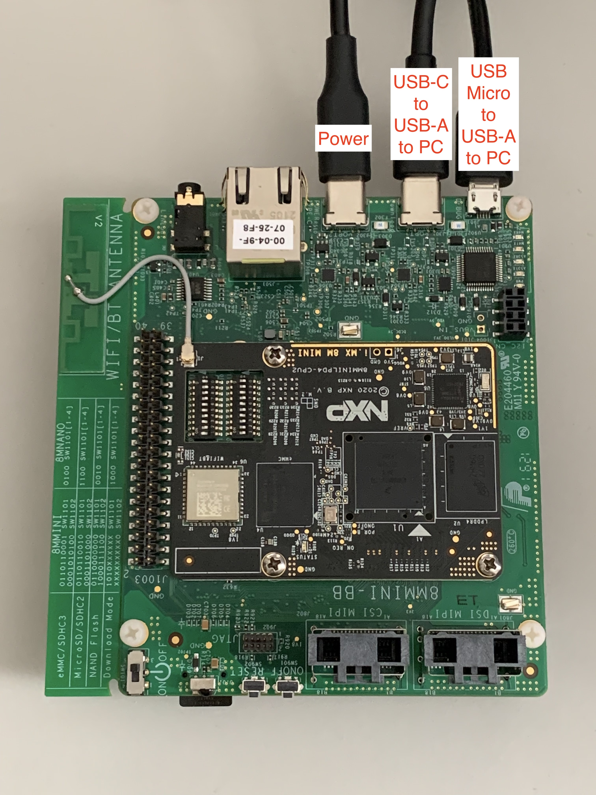
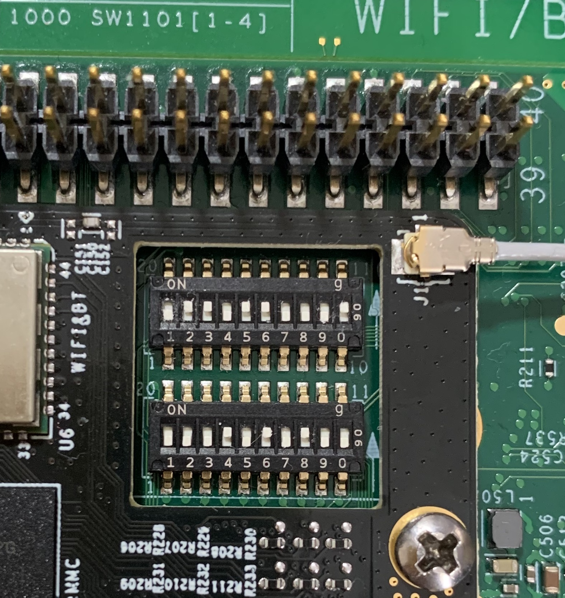
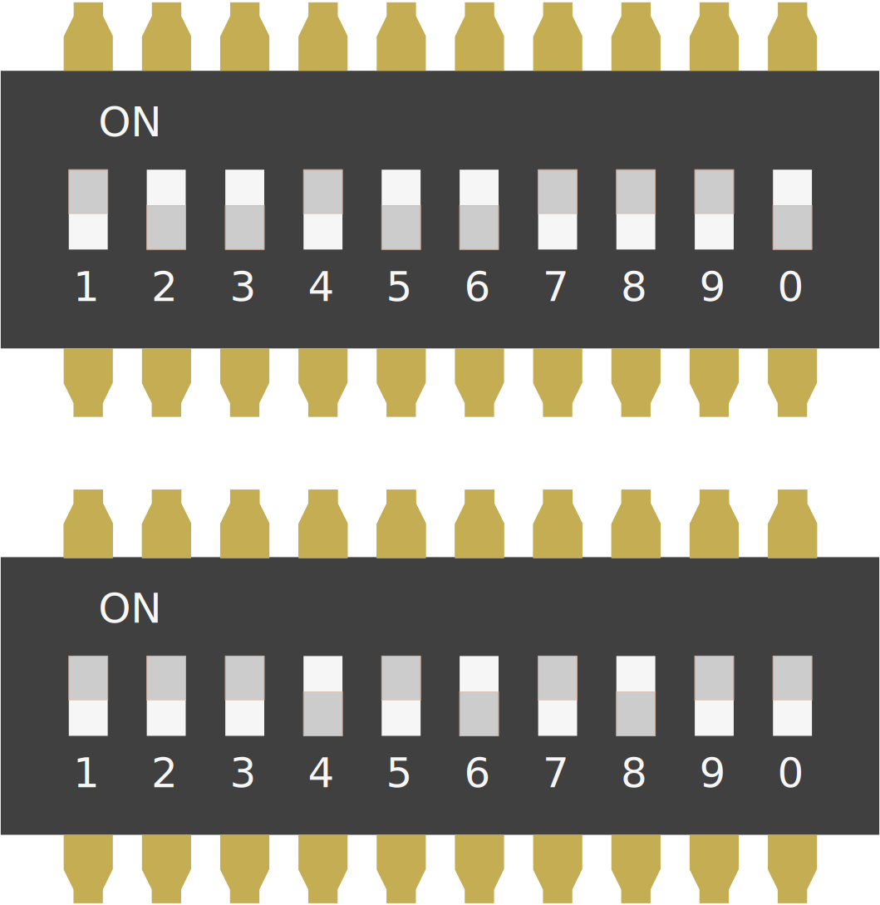

# NXP i.MX 8M Mini EVK



What is needed:
-	[NXP i.MX 8M Mini EVK](https://www.nxp.com/design/development-boards/i-mx-evaluation-and-development-boards/evaluation-kit-for-the-i-mx-8m-mini-applications-processor:8MMINILPD4-EVK)
-	USB-C power supply (comes with EVK kit)
-	USB-A -> USB-C cable for uploading to eMMC (comes with EVK)
-  Optional: USB-A -> USB-Micro cable for UART log (comes with EVK)
-	Optional: Power plug adapter – the kit might not come with the correct
    country plug on the power supply.

# Making the board SystemReady
1) Download and extract `i.MX 8M Mini EVK boot image(SystemReady-IR certified)`
   from [here](https://www.nxp.com/design/software/embedded-software/i-mx-software/embedded-linux-for-i-mx-applications-processors:IMXLINUX?tab=In-Depth_Tab)
   (Requires NXP Login).

2) Download the `uuu` tool used to program the boards on-board eMMC from
   [here](https://github.com/NXPmicro/mfgtools/releases).

>Note: At the time of writing, there are known issues with MacOS, use a Linux VM
>      instead. The device will change VID/PID twice in the process of uploading
>      firmware, so you may need to pass several devices through to the VM. If
>      `uuu` times out, just power cycle the board and try again.

3) Slide the power switch to the `off` position and set the boot mode switches
   to `Download Mode`
<p float="left">
  
  
</p>

|   |SW1|SW2|SW3|SW4|SW5|SW6|SW7|SW8|SW9|SW0|
|---|---|---|---|---|---|---|---|---|---|---|
|Top Row|1|0|1|0|X|X|X|X|X|X|
|Bottom Row|X|X|X|X|X|X|X|X|X|0|

1=Switch Up, 0=Switch Down, X=Don’t Care


4) Connect USB-C Power cable, USB-C USB cable to PC, USB Micro cable to PC
   (serial)



5) Slide the power switch to the “on” position and flash the boot firmware
   downloaded in step 1:
```
$ sudo uuu -b emmc imx-boot-imx8mmevk-sd.bin-flash_evk
```
This will install a SystemReady compatible version of U-Boot to the on-board
eMMC

6) Slide the power switch back to the `off` position and set the boot mode
   switches to `eMMC mode`

<p float="left">
  
  
</p>

|   |SW1|SW2|SW3|SW4|SW5|SW6|SW7|SW8|SW9|SW0|
|---|---|---|---|---|---|---|---|---|---|---|
|Top Row|0|1|1|0|1|1|0|0|0|1|
|Bottom Row|0|0|0|1|0|1|0|1|0|0|

1=Switch Up, 0=Switch Down, X=Don’t Care


7) The board is now ready to boot SystemReady compatible operating systems from
   SD Card, or USB

> Note: SD Card is recommended for the OS installer to reduce the likelihood of
>       compatibility issues relating to the USB-C port (e.g missing kernel
>       drivers)
 
