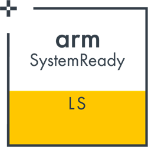
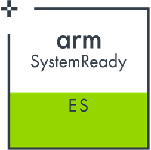
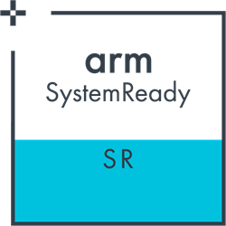

# Arm SystemReady Guides
[![CC BY-SA 4.0][cc-by-sa-shield]][cc-by-sa]

This repository hosts a series of guides on how to setup devices that are
Arm SystemReady certified and their firmware.

The Arm SystemReady program is a foundational compliance certification program
to ensure software *"just works"* across a vibrant, diverse ecosystem of
hardware. It builds on the former ServerReady program, setting the standards for
a broader set of devices for the server, infrastructure edge and IoT edge
sectors.

There are four main bands of SystemReady: SR - ServerReady, ES - Embedded Server,
IR - IoT, and LS - LinuxBoot Server. These bands are based on combinations or
recipes from the
[Base System Architecture (BSA)](https://developer.arm.com/architectures/system-architectures/arm-systemready/specifications#bsa),
supplements such as the
[Server Base System Architecture (SBSA)](https://developer.arm.com/architectures/system-architectures/arm-systemready/specifications#sbsa),
and the
[Base Boot Requirements (BBR)](https://developer.arm.com/architectures/system-architectures/arm-systemready/specifications#bbr)
specifications.

## SystemReady Bands

<table>
  <tbody>
    <tr>
        <td>&nbsp;</td>
        <td>
        

        </td>
        <td>
        

        </td>
        <td>
        

        </td>
        <td>
        

        </td>
    </tr>
    <tr>
        <td><strong>SystemReady bands</strong></td>
        <td>
        
<a href="https://developer.arm.com//architectures/system-architectures/arm-systemready/ls">LS - LinuxBoot Server</a>

        </td>
        <td>
        
<a href="https://developer.arm.com//architectures/system-architectures/arm-systemready/ir">IR - IoT</a>

        </td>
        <td>
        
<a href="https://developer.arm.com//architectures/system-architectures/arm-systemready/es">ES - Embedded Server</a>

        </td>
        <td>
        
<a href="https://developer.arm.com//architectures/system-architectures/arm-systemready/sr">SR - ServerReady</a>

        </td>
    </tr>
    <tr>
        <td><strong>Specification and BBR recipe</strong></td>
        <td>
        <ul>
            <li>BSA</li>
            <li>SBSA</li>
            <li>LBBR</li>
        </ul>
        </td>
        <td>
        <ul>
            <li>BSA</li>
            <li>EBBR</li>
        </ul>
        </td>
        <td>
        <ul>
            <li>BSA</li>
            <li>SBBR</li>
        </ul>
        </td>
        <td>
        <ul>
            <li>BSA</li>
            <li>SBSA</li>
            <li>SBBR</li>
        </ul>
        </td>
    </tr>
    <tr>
        <td><strong>Firmware specifications</strong></td>
        <td>
        <ul>
            <li>ACPI</li>
            <li>SMBIOS</li>
        </ul>
        </td>
        <td>
        <ul>
            <li>UEFI</li>
            <li>Devicetree</li>
        </ul>
        </td>
        <td>
        <ul>
            <li>UEFI</li>
            <li>ACPI</li>
            <li>SMBIOS</li>
        </ul>
        </td>
        <td>
        <ul>
            <li>UEFI</li>
            <li>ACPI</li>
            <li>SMBIOS</li>
        </ul>
        </td>
    </tr>
    <tr>
        <td><strong>Platform hardware</strong></td>
        <td>64-bit Arm</td>
        <td>32-bit or 64-bit Arm</td>
        <td>64-bit Arm</td>
        <td>64-bit Arm</td>
    </tr>
    <tr>
        <td><strong>Security extension</strong></td>
        <td>N/A</td>
        <td colspan="3" style="text-align: center;">Can support UEFI SecureBoot and secure firmware update through UEFI Capsule Service across (BBSR)</td>
    </tr>
    <tr>
        <td><strong>Operating system or hypervisor</strong></td>
        <td>Linux</td>
        <td>Linux</td>
        <td>Generic, off-the-shelf with exceptions, RAS and virtualization.</td>
        <td>Generic, off-the-shelf</td>
    </tr>
  </tbody>
</table>

---
# Guides
## SystemReady-LR
-
## SystemReady-IR
- [NXP i.MX 8M Mini EVK](NXP/i.mx_8m_mini_EVK/readme.md)
## SystemReady-ES
- [Raspberry Pi 4](Raspberry%20Pi/Raspberry%20Pi%204/readme.md)
## SystemReady-SR
-

---

## Contributing
Pull requests are welcome. If adding a new device, it must be officially certified at: https://developer.arm.com/architectures/system-architectures/arm-systemready. If making any major changes to a guide, please first open an issue to discuss it.

## License
[![CC BY-SA 4.0][cc-by-sa-image]][cc-by-sa]

This work is licensed under a
[Creative Commons Attribution-ShareAlike 4.0 International License][cc-by-sa].

[cc-by-sa]: http://creativecommons.org/licenses/by-sa/4.0/
[cc-by-sa-image]: https://licensebuttons.net/l/by-sa/4.0/88x31.png
[cc-by-sa-shield]: https://img.shields.io/badge/License-CC%20BY--SA%204.0-lightgrey.svg