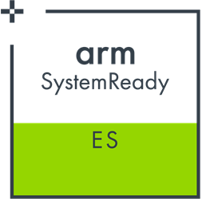
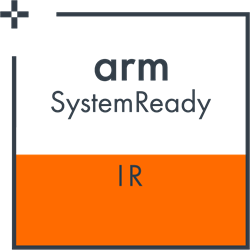
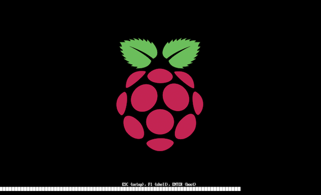
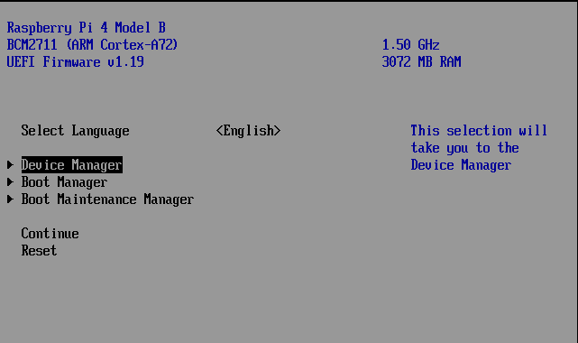
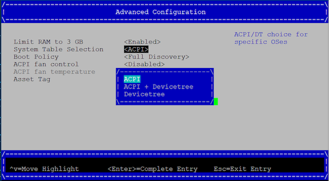

# Raspberry Pi 400

What is needed:
- [Raspberry Pi 4 400](https://www.raspberrypi.org/products/raspberry-pi-400-unit/)
- USB-C power supply
- MicroSD card or USB drive if using [USB bootloader](https://www.raspberrypi.org/documentation/hardware/raspberrypi/bootmodes/msd.md) (at least 16MB)
- If using microSD: A USB card reader

# Making the board SystemReady
1) Download the latest Raspberry Pi 4 UEFI Firmware image from https://github.com/pftf/RPi4/releases.

2) Format MicroSD/USB to FAT32.

3) Extract the zip file downloaded in step 1) to the newly formatted
   MicroSD/USB.

4) Properly eject the MicroSD/USB to ensure it has finished writing, and insert
   it into the board.

5) The board is now ready to boot SystemReady compatible operating systems from
   a SD Card or USB. Note: The SD/USB created in this guide must remain, the OS
   installer must be on a *second* drive, and the OS then be installed onto a
   *third* drive.

## Selecting between SystemReady ES and SystemReady IR
The Raspberry Pi is certified for both SystemReady ES (ACPI) and SystemReady IR
(Devicetree). You can toggle which is used in the UEFI menu by following these
steps:

1. Enter the UEFI menu by pressing `Esc` during boot

   
2. In UEFI menu navigate to `Device Manager` > `Raspberry Pi Configuration` > `Advanced Configuration`

   
3. The `System Table Selection` option will allow you to pick how UEFI present
   the Raspberry Pi hardware to the OS:
      - ACPI - SystemReady ES
      - Devicetree - SystemReady IR

   
